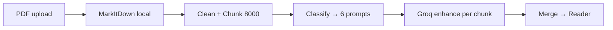

<div align="center">

<pre>
 ███╗   ███╗ █████╗ ██████╗ ██╗  ██╗███████╗ ██████╗ ██████╗  ██████╗ ███████╗
 ████╗ ████║██╔══██╗██╔══██╗██║ ██╔╝██╔════╝██╔═══██╗██╔══██╗██╔════╝ ██╔════╝
 ██╔████╔██║███████║██████╔╝█████╔╝ █████╗  ██║   ██║██████╔╝██║  ███╗█████╗
 ██║╚██╔╝██║██╔══██║██╔══██╗██╔═██╗ ██╔══╝  ██║   ██║██╔══██╗██║   ██║██╔══╝
 ██║ ╚═╝ ██║██║  ██║██║  ██║██║  ██╗██║     ╚██████╔╝██║  ██║╚██████╔╝███████╗
</pre>

# MarkForge — PDFs, distilled into knowledge.

**Transform dense PDFs into structured, readable documents. Not a summary. Not a chatbot.**

[](#tech-stack) [](#how-it-works) [](#why-markitdown) [](#license)

[Live Demo](https://markforge.app) • [API Docs](#api) • [Report Bug](https://github.com/Sumitr995/MarkForge/issues)

</div>

---

### Why MarkForge?

ChatPDF **answers**. Summarizers **shorten**. Converters **dump**.  
**MarkForge restructures** — same knowledge, 10× more readable.

> 40-page paper → 12 sections, TOC, callouts, tables. Ready to revise, not just scroll.

**Cost:** Direct PDF → LLM = `~30k tokens ($0.30–$1.20)`.  
MarkForge = `MarkItDown (0 tokens) + Groq on clean markdown ($0.01–$0.04)` → **10–30× cheaper**.

---

### Demo

| Upload | Reader |
|---|---|
|  |  |
| Drop PDF → 20 MB max → distill | TOC + callouts + tables + copy/export |

Try locally: `http://localhost:3000/app` → `http://localhost:3000/reader`

---

### Features

| | What | How |
|---|---|---|
| **[+]** | **Zero-token extraction** | `MarkItDown` parses locally. No LLM cost. Tables intact. |
| **[+]** | **Knows your doc** | Groq classifies → 1 of 6 prompts (research / book / notes / docs / knowledge / general) |
| **[+]** | **Built for long docs** | `8000-char` chunks. Free-tier safe. Parallel enhance. |
| **[✓]** | **Structure, not summary** | TOC, definition cards, code blocks. Notion-like reading. |
| **[✓]** | **Private by default** | Temp file → `finally { delete }`. Never stored. |
| **[→]** | **Next** | Image viewer, Mermaid, PDF export, flashcards |

---

### How it works



**6 steps:**
1. **Upload** — `Multer` validates `PDF + 20 MB` → `uploads/temp`
2. **Extract** — `python convert.py` → `MarkItDown + PyMuPDF` → `{ markdown, assets }` via `JSON stdout`
3. **Split** — `MarkdownPreprocessor` → `ChunkService`
4. **Route** — `DocumentClassifier (Groq)` → `PromptRouter`
5. **Enhance** — `AI SDK + Groq llama-3.3-70b` → `MergeService`
6. **Read** — `{ originalName, markdown, assets }` → React reader (TOC, copy, export)

---

### Tech Stack

| Layer | Stack |
|---|---|
| **Frontend** | React 19, Vite 6, Tailwind 4, shadcn/ui, Framer Motion, Zustand, `bun` |
| **Backend** | Express 5, TypeScript 6, Multer, Zod, `helmet/cors/morgan` |
| **AI** | Vercel AI SDK, Groq (`llama-3.3-70b`), OpenAI fallback |
| **Python** | `markitdown 0.1.6`, `PyMuPDF 1.28`, `python-dotenv` |
| **Infra** | Docker (recommended), `child_process.execFile` bridge |

---

### Quick Start

**Prereqs:** `Node 20+`, `Python 3.11+`, `bun`

```bash
# 1. Python — extract engine
cd python
python -m venv .venv
.venv\Scripts\activate        # Windows
# source .venv/bin/activate   # macOS/Linux
pip install -r requirements.txt

# 2. Backend — http://localhost:5000
cd ../backend
cp .env.example .env          # set GROQ_API_KEY
npm install
npm run dev                   # tsx watch src/server.ts

# 3. Frontend — http://localhost:3000 (/api → :5000 via proxy)
cd ../frontend
cp .env.example .env.local    # VITE_API_URL=http://localhost:5000
bun install
bun run dev
```

Env: see [`backend/.env.example`](./backend/.env.example) + [`frontend/.env.example`](./frontend/.env.example)

---

### API

**Base:** `/api/v1`

```bash
# Upload
curl -X POST http://localhost:5000/api/v1/documents/upload \
  -F file=@paper.pdf
# → { "success": true, "data": { "originalName": "paper.pdf", "markdown": "# ...", "assets": [] } }

# Health
curl http://localhost:5000/api/v1/health
```

| Field | Constraint |
|---|---|
| `file` | `PDF` only, `20 MB` max, `multipart/form-data` |
| `assets` | `{ type: "image", path: "/uploads/...", page: 1 }[]` |

Full contract: [`Context/API.md`](./Context/API.md) • [`Context/CONTRACTS.md`](./Context/CONTRACTS.md)

---

### Project Structure

```
MarkForge/
├── backend/   Express API — routes / services / AI pipeline
├── frontend/  React + Vite — sections / reader / theme (system/light/dark)
├── python/    MarkItDown + PyMuPDF — convert.py → JSON
└── Context/   Architecture, Decisions, Roadmap
```

Deep dive: [`Context/ARCHITECTURE.md`](./Context/ARCHITECTURE.md)

---

### Configuration

**Backend `.env`**
```ini
PORT=5000
GROQ_API_KEY=gsk_...
GROQ_MODEL=openai/gpt-oss-120b
PYTHON_PATH=              # auto: ../python/.venv/bin/python
ASSETS_DIR=               # default: uploads/assets
```

**Frontend `.env.local`**
```ini
VITE_API_URL=http://localhost:5000
VITE_API_PUBLIC_URL=https://api.markforge.app
VITE_SITE_URL=https://markforge.app
```

---

### Deploy

> **Docker only** — needs Python subprocess + FS. Not Vercel serverless.

```bash
# Backend + Python image
docker build -f backend/Dockerfile -t markforge-api ./backend
docker run -p 5000:5000 --env-file backend/.env markforge-api

# Frontend (nginx)
docker build -f frontend/Dockerfile -t markforge-web ./frontend
# or Vercel: vercel --prod (frontend only, API stays on Render/Railway/Fly)
```

Recommended: **Render / Railway / Fly** → single `Dockerfile`.

---

### Roadmap

- [x] MarkItDown + Groq pipeline
- [x] Reader with TOC + export
- [x] Theme toggler (system/light/dark)
- [ ] Semantic chunking (heading-aware)
- [ ] Image viewer + Mermaid
- [ ] PDF export, flashcards, quiz
- `Early readers + Pricing` — hidden, coming soon.

See [`Context/ROADMAP.md`](./Context/ROADMAP.md)

---

### Built solo by Sumit Rathod

<div>
  
</div>

**Sumit Rathod — @Sumitr995** · Mumbai, India · Full Stack / Cloud / Realtime Systems

[Portfolio](https://sumitr995.me) · [GitHub](https://github.com/Sumitr995) · [Project Repo](https://github.com/Sumitr995/MarkForge) · [LinkedIn](https://www.linkedin.com/in/Sumitr995/)

> Solo indie — no team, no tracking. PRs welcome.

---

### License

MIT — do what you want, just keep the credit.

<div align="center">

`$ markforge --help` — PDFs made readable.

</div>
