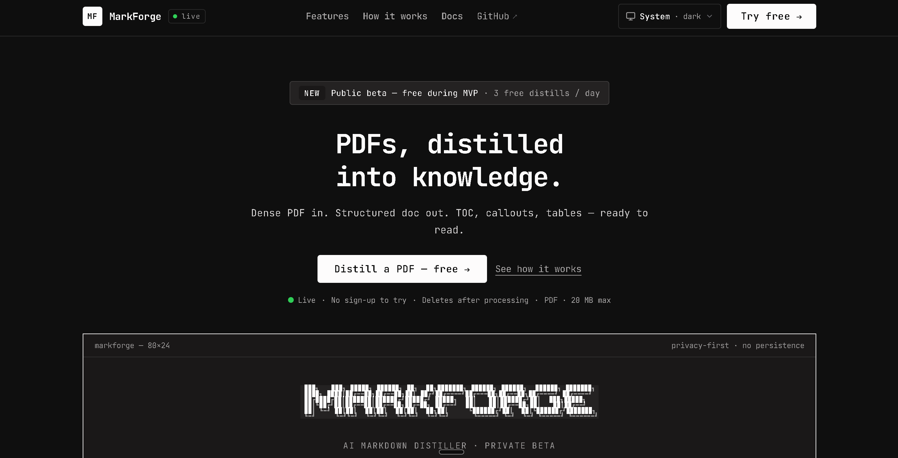
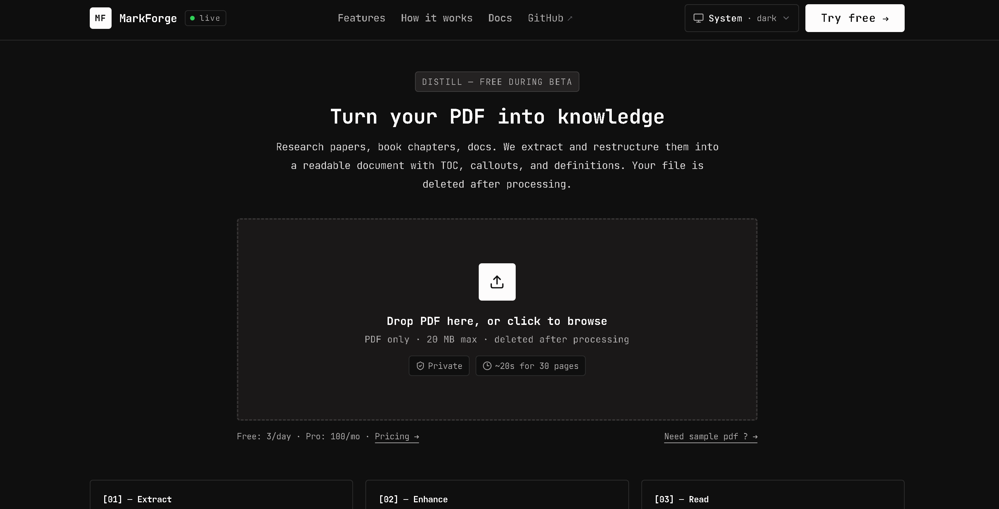
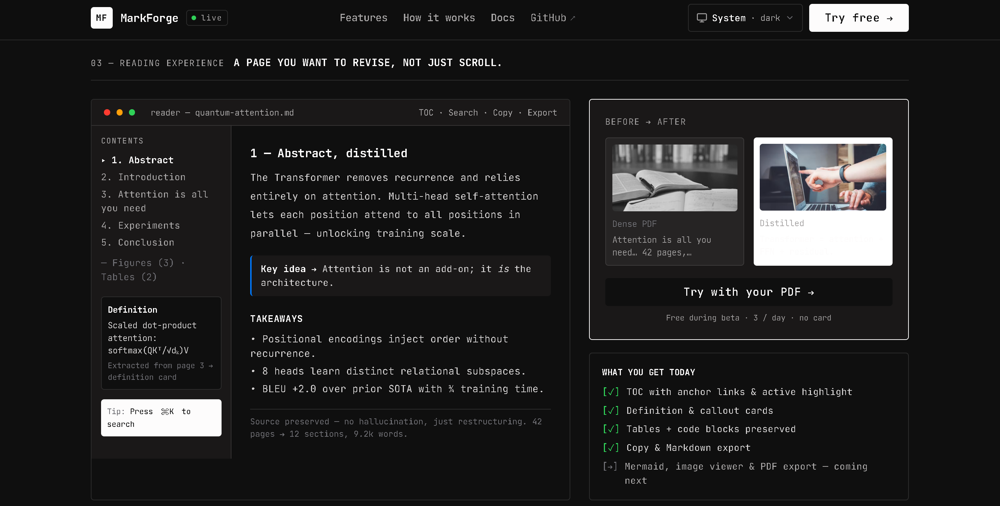
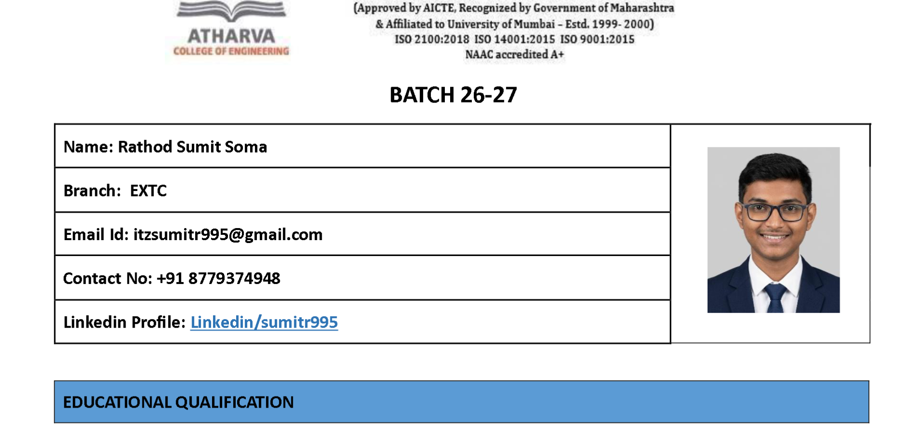
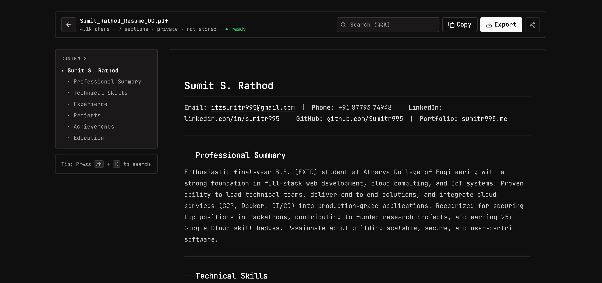
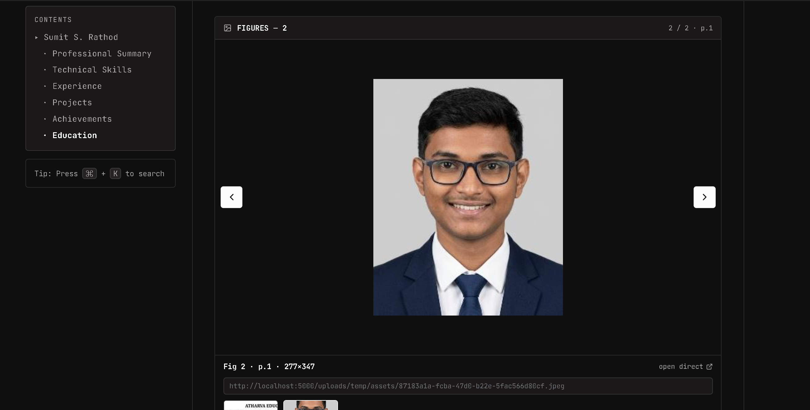
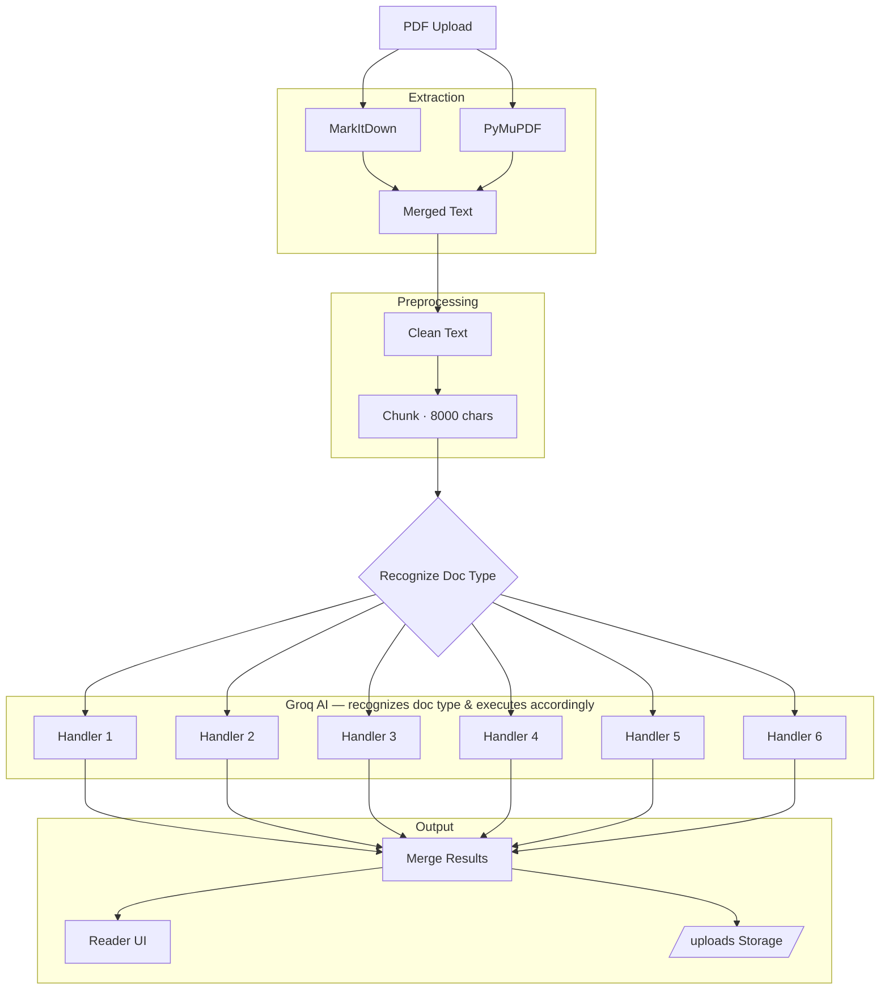

<div align="center">

<pre>
 ███╗   ███╗ █████╗ ██████╗ ██╗  ██╗███████╗ ██████╗ ██████╗  ██████╗ ███████╗
 ████╗ ████║██╔══██╗██╔══██╗██║ ██╔╝██╔════╝██╔═══██╗██╔══██╗██╔════╝ ██╔════╝
 ██╔████╔██║███████║██████╔╝█████╔╝ █████╗  ██║   ██║██████╔╝██║  ███╗█████╗
 ██║╚██╔╝██║██╔══██║██╔══██╗██╔═██╗ ██╔══╝  ██║   ██║██╔══██╗██║   ██║██╔══╝
 ██║ ╚═╝ ██║██║  ██║██║  ██║██║  ██╗██║     ╚██████╔╝██║  ██║╚██████╔╝███████╗
</pre>

# MarkForge — PDFs, distilled into knowledge.

**Transform dense PDFs into structured, readable documents. Not a summary. Not a chatbot.**

[](https://markforge.sumitr995.me) [](https://markforge.onrender.com/api/v1/health) [](#tech-stack) [](#how-it-works) [](#license)

[Live Demo](https://markforge.sumitr995.me/app) • [API Docs](#api) • [Architecture](./Context/ARCHITECTURE.md) • [Report Bug](https://github.com/Sumitr995/MarkForge/issues)

</div>

---

### Why MarkForge?

ChatPDF **answers**. Summarizers **shorten**. Converters **dump**.  
**MarkForge restructures** — same knowledge, 10× more readable.

> 40-page paper → 12 sections, TOC, callouts, tables, definition cards. Ready to revise, not just scroll.

**Cost:** Direct PDF → LLM = `~30k tokens ($0.30–$1.20)`.  
MarkForge = `MarkItDown (0 tokens) + Groq on clean markdown ($0.01–$0.04)` → **10–30× cheaper** — local extraction, no LLM cost for tables.

---

### Live

| Service | URL | Status |
|---|---|---|
| **Frontend** | [`markforge.sumitr995.me`](https://markforge.sumitr995.me) (Vercel) | `Vite + React 19` |
| **API** | [`markforge.onrender.com`](https://markforge.onrender.com/api/v1/health) (Render) | `Express 5 + Python 3.12` |
| **Demo PDF** | [`/demo/Sumit_Resume.pdf`](./frontend/public/demo/Sumit_Resume.pdf) | One-click `Try demo` on `/app` |

Custom domain: `sumitr995.me` on Namecheap → `CNAME markforge → cname.vercel-dns.com`, `CNAME api.markforge → markforge.onrender.com`.

---

### Demo

**Landing → Upload → Reading**

| Landing | Upload | Reading |
|---|---|---|
|  |  |  |
| Hero — ASCII + CTA | Drop PDF → 20 MB → `Need sample PDF?` → `Sumit_Resume.pdf` | TOC + callouts + gallery + copy/export |

Try: `https://markforge.sumitr995.me/app` → `Need sample PDF? Try Sumit_Resume.pdf →` — no upload needed.

**Before → After**

| Before (dense PDF) | After (distilled) |
|---|---|
|  |  |
| 42 pages, no structure, hard to revise | 12 sections, TOC, definition cards — same knowledge, 10× readable |

Full after view: 

---

### Features

| | What | How |
|---|---|---|
| **[+]** | **Zero-token extraction** | `MarkItDown 0.1.6` locally. Tables intact. No LLM for parsing. |
| **[+]** | **Knows your doc** | Groq classifies → 1 of 6 prompts (research / book / notes / docs / knowledge / general) |
| **[+]** | **Long-doc safe** | `8000-char` chunks, parallel Groq, `120s` timeout. Free-tier safe. |
| **[✓]** | **Structure, not summary** | TOC, definition cards, code blocks, image gallery. Notion-like. |
| **[✓]** | **Private by default** | `uploads/temp` → `finally { deleteFile }`. Assets `24h` via `ASSET_RETENTION_MS`. Never stored. |
| **[→]** | **Themed UX** | Mono `Berkeley Mono → JetBrains Mono`, cream `#fdfcfc` / ink `#201d1d`, `4px`, `sonner` themed toasts, `system/light/dark` |
| **[→]** | **Next** | Semantic chunking, Mermaid, PDF export, flashcards |

---

### How it works



**6 steps:**
1. **Upload** — `Multer` validates `PDF + 20 MB` → `uploads/temp` (`backend/src/middleware/upload.middleware.ts:8`)
2. **Extract** — `python:3.12` `convert.py` → `MarkItDown + PyMuPDF` → `{ markdown, assets }` via `JSON stdout` (`backend/src/services/markdown/markdown.service.ts:1`)
3. **Split** — `MarkdownPreprocessor` → `ChunkService (8000)`
4. **Route** — `DocumentClassifier (Groq)` → `PromptRouter` (6 templates)
5. **Enhance** — `Vercel AI SDK + Groq llama-3.3-70b` → `MergeService`
6. **Read** — `{ originalName, markdown, assets: "https://.../uploads/..." }` → React reader (TOC, copy, export, gallery)

`BACKEND_URL` env controls asset URLs — `https://markforge.onrender.com` in prod, `http://localhost:5000` locally (`backend/src/services/document/document.service.ts:66`).

---

### Tech Stack

| Layer | Stack |
|---|---|
| **Frontend** | React 19, Vite 6, Tailwind 4, shadcn/ui, Framer Motion, GSAP, Zustand, `bun`, `sonner` (themed) |
| **Backend** | Express 5, TypeScript 6, Multer, Zod, `helmet/cors/morgan`, `tsx` |
| **AI** | Vercel AI SDK, Groq `llama-3.3-70b` (`openai/gpt-oss-120b` via `GROQ_MODEL`), OpenAI fallback |
| **Python** | `python 3.12`, `markitdown 0.1.6`, `PyMuPDF 1.28` — `convert.py` + `assets.py` |
| **Infra** | `python:3.12-slim` + Node 20 Docker (single image), Render (API) + Vercel (web), `child_process.execFile` bridge |

> Requires `Python ≥3.12` — `numpy==2.5.0` needs it. `node:20-slim` (Python 3.11) fails; `Dockerfile:5` uses `python:3.12-slim`.

---

### Quick Start

**Prereqs:** `Node 20+`, `Python 3.12+`, `bun`

```bash
# 1. Python — extract engine
cd python
python -m venv .venv
.venv\Scripts\activate        # Windows
# source .venv/bin/activate   # macOS/Linux
pip install -r requirements.txt

# 2. Backend — http://localhost:5000
cd ../backend
cp .env.example .env          # set GROQ_API_KEY, BACKEND_URL=http://localhost:5000
npm install
npm run dev                   # tsx watch src/server.ts

# 3. Frontend — http://localhost:3000 (/api → :5000 via proxy)
cd ../frontend
# VITE_API_URL="" uses Vite proxy; set http://localhost:5000 explicitly if needed
bun install
bun run dev
```

Env: [`backend/.env.example`](./backend/.env.example) • [`frontend/.env.example`](./frontend/.env.example) • [`Context/ARCHITECTURE.md`](./Context/ARCHITECTURE.md)

---

### Configuration

**Backend `backend/.env.example`**

```ini
PORT=5000
NODE_ENV=development
GROQ_API_KEY=gsk_...
GROQ_MODEL=openai/gpt-oss-120b
OPENAI_API_KEY=sk-...
PYTHON_PATH=              # auto: ../python/.venv/bin/python → /usr/local/bin/python (Docker)
PYTHON_SCRIPT=            # auto: ../python/scripts/convert.py → /app/python/scripts/convert.py
ASSETS_DIR=               # default: uploads/assets → /app/backend/uploads/assets
BACKEND_URL=http://localhost:5000 # prod: https://markforge.onrender.com (asset base)
ASSET_RETENTION_MS=86400000
```

`PYTHON_PATH/SCRIPT/ASSETS_DIR/BACKEND_URL` are all auto-detected if empty — see `backend/src/config/env.ts:26` + `markdown.service.ts:12`. Set them only in Docker/Render.

**Frontend `frontend/.env.example`**

```ini
# "" = same-origin (Vite proxy in dev, Vercel rewrite in prod)
VITE_API_URL=https://markforge.onrender.com
VITE_API_PUBLIC_URL=https://markforge.onrender.com
VITE_SITE_URL=https://markforge.sumitr995.me
```

`VITE_API_URL` drives `API_URL` (`frontend/src/lib/constants.ts:3`), `VITE_SITE_URL` drives OG/curl examples.

---

### API

**Base:** `https://markforge.onrender.com/api/v1` (local `http://localhost:5000/api/v1`)

```bash
# Upload — field: file, PDF 20MB
curl -X POST https://markforge.onrender.com/api/v1/documents/upload \
  -F file=@paper.pdf
# → { "success": true, "data": { "originalName": "paper.pdf", "markdown": "# ...", "assets": [{ "type":"image","path":"https://.../uploads/temp/assets/xxx.png","page":1 }] } }

# Try demo PDF (no local file needed)
curl -s https://markforge.sumitr995.me/demo/Sumit_Resume.pdf -o /tmp/demo.pdf
curl -X POST https://markforge.onrender.com/api/v1/documents/upload -F file=@/tmp/demo.pdf

# Health
curl https://markforge.onrender.com/api/v1/health
# → { "success": true, "status": "OK" }
```

| Field | Constraint |
|---|---|
| `file` | `PDF` only, `20 MB` max, `multipart/form-data` |
| `assets` | `{ type: "image", path: "https://.../uploads/...", page: 1 }[]` — served via `express.static(/uploads)` |

Full contract: [`Context/API.md`](./Context/API.md) • [`Context/CONTRACTS.md`](./Context/CONTRACTS.md)

---

### Project Structure

```
MarkForge/
├── Dockerfile              # python:3.12-slim + Node 20 — backend + python in one image (context = root)
├── backend/
│   ├── Dockerfile          # same as root, for Render (Root Directory = "")
│   ├── src/                # Express API — routes / services / AI pipeline
│   └── uploads/temp/       # ephemeral — deleted per request, assets 24h
├── frontend/
│   ├── public/demo/Sumit_Resume.pdf  # demo sample — fetched by Dropzone "Need sample PDF?"
│   ├── src/                # React + Vite — sections / reader / theme (system/light/dark)
│   └── vercel.json         # SPA rewrite + bun build
├── python/
│   ├── scripts/convert.py  # entry — prints JSON { markdown, assets }
│   └── services/           # markdown.py (MarkItDown) + assets.py (PyMuPDF)
└── Context/                # Architecture, Decisions, Roadmap
```

Deep dive: [`Context/ARCHITECTURE.md`](./Context/ARCHITECTURE.md) — request/runtime/data/error flow + service table.

---

### Deploy (free, perfect)

> Backend needs Python — not Vercel serverless. Use Render (Docker) + Vercel (frontend).

**1. Backend → Render (free 750h)**

* Repo: `https://github.com/Sumitr995/MarkForge`
* Render → New Web Service → `Docker` → Root Directory `""` → Dockerfile ` ./Dockerfile` (or `./backend/Dockerfile`)
* Env (from `backend/.env.production`):
  ```
  NODE_ENV=production
  GROQ_API_KEY=gsk_...
  GROQ_MODEL=openai/gpt-oss-120b
  PYTHON_PATH=/usr/local/bin/python
  PYTHON_SCRIPT=/app/python/scripts/convert.py
  ASSETS_DIR=/app/backend/uploads/assets
  BACKEND_URL=https://markforge.onrender.com
  ```
* Deploys in ~3 min — test `GET /api/v1/health`

**2. Frontend → Vercel (free)**

* Vercel → Import `MarkForge` → Root Directory `frontend` → `bun install` + `bun run build` (`vercel.json`)
* Env:
  ```
  VITE_API_URL=https://markforge.onrender.com
  VITE_API_PUBLIC_URL=https://markforge.onrender.com
  VITE_SITE_URL=https://markforge.sumitr995.me
  ```
* Custom domain: Vercel → Domains → `markforge.sumitr995.me` → Namecheap `CNAME markforge → cname.vercel-dns.com` → auto SSL

**Docker locally**

```bash
docker build -f Dockerfile -t markforge:local .   # context = root (needs python/ + backend/)
docker run -p 5000:5000 --env-file backend/.env.production markforge:local
# Frontend
docker build -f frontend/Dockerfile -t markforge-web ./frontend  # or Vercel
```

---

### Roadmap

- [x] MarkItDown + Groq pipeline + `ExtractionResult { assets }`
- [x] Reader (TOC, markdown, copy/export, gallery, health dot)
- [x] Theme `system/light/dark` + `sonner` mono toasts + `Sumit_Resume.pdf` demo
- [x] Deploy artifacts — `Dockerfile` (python:3.12) + `vercel.json` + `nginx.conf` + custom domain
- [ ] Semantic chunking (heading-aware, not `8000`-char split)
- [ ] Image viewer + Mermaid + `MergeService` heading-aware
- [ ] PDF export, flashcards, quiz
- `Early readers + Pricing` — hidden, coming soon.

See [`Context/ROADMAP.md`](./Context/ROADMAP.md)

---

### Built solo by Sumit Rathod

<div>
  
</div>

**Sumit Rathod — @Sumitr995** · Mumbai, India · Full Stack / Cloud / Realtime

[Portfolio](https://sumitr995.me) · [GitHub](https://github.com/Sumitr995) · [Project Repo](https://github.com/Sumitr995/MarkForge) · [LinkedIn](https://www.linkedin.com/in/Sumitr995/)

> Solo indie — no team, no tracking. PRs welcome.

---

### License

MIT — do what you want, just keep the credit.

<div align="center">

`$ markforge --help` — PDFs made readable.

</div>
